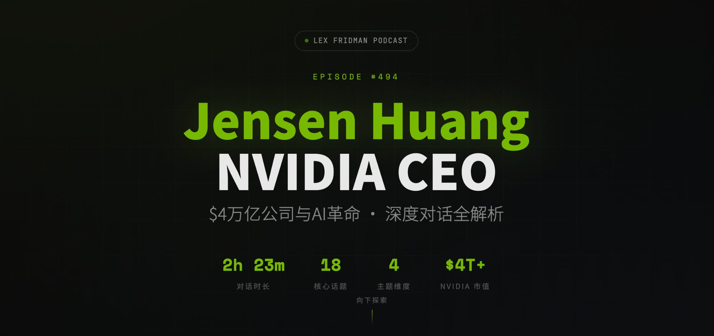

# Jensen Huang × Lex Fridman Podcast #494 
[🔗Interactive Demo](https://siryzhang.github.io/jensen-lex-324/)




> **Jensen Huang: NVIDIA CEO — The $4 Trillion Company & the AI Revolution**
> 
> Lex Fridman Podcast #494 · March 24, 2026 · 2h 23m

An interactive web page that deconstructs the full 2-hour-23-minute conversation between Lex Fridman and Jensen Huang (CEO of NVIDIA) into a navigable, visual experience.

## ✨ Features

- **Interactive Timeline** — 20 topic markers on a scrollable timeline, color-coded by category. Click any node to jump into details with a direct YouTube timestamp link.
- **18 Topic Deep-Dive Cards** — Filterable by four dimensions: Technology / Business Strategy / Leadership / Philosophy. Each card expands into a modal with key insights and a one-click link to the exact YouTube moment.
- **AI Infrastructure Map** — An interactive network-topology visualization of the AI stack Jensen described. Click any node (GPU, Memory, CUDA, TSMC, Power, etc.) to see animated data-flow connections and a detail panel.
- **Key Insights Collection** — 9 distilled quotes and takeaways from the conversation.

## 📂 Structure

```
├── index.html      # Single-file interactive page (no dependencies)
├── cover.png       # Cover image
└── README.md
```

## 🗂 Topics Covered

| # | Topic | Category | Timestamp |
|---|-------|----------|-----------|
| 01 | Extreme Co-Design & Rack-Scale Engineering | 🔧 Tech | 00:06:34 |
| 02 | How Jensen Runs NVIDIA | 👑 Leadership | 00:09:20 |
| 03 | AI Scaling Laws | 🔧 Tech | 00:28:41 |
| 04 | Biggest Blockers to AI Scaling | 🔧 Tech | 00:43:41 |
| 05 | Supply Chain | 📈 Business | 00:45:25 |
| 06 | Memory | 🔧 Tech | 00:47:20 |
| 07 | Power | 🔧 Tech | 00:53:25 |
| 08 | Elon Musk & Colossus | 👑 Leadership | 00:58:45 |
| 09 | Jensen's Engineering & Leadership Philosophy | 👑 Leadership | 01:02:13 |
| 10 | China | 📈 Business | 01:07:38 |
| 11 | TSMC & Taiwan | 📈 Business | 01:15:51 |
| 12 | NVIDIA's Moat | 📈 Business | 01:21:06 |
| 13 | AI Data Centers in Space | 📈 Business | 01:26:43 |
| 14 | Will NVIDIA Be Worth $10 Trillion? | 📈 Business | 01:30:31 |
| 15 | Leadership Under Pressure | 👑 Leadership | 01:40:40 |
| 16 | Video Games | 💭 Philosophy | 01:54:26 |
| 17 | AGI Timeline | 💭 Philosophy | 02:01:18 |
| 18 | Future of Programming | 💭 Philosophy | 02:03:31 |
| 19 | Consciousness | 💭 Philosophy | 02:17:02 |
| 20 | Mortality | 💭 Philosophy | 02:23:23 |

## 🔗 Links

- 🎬 [Watch the Full Podcast on YouTube](https://www.youtube.com/watch?v=vif8NQcjVf0)
- 🎙 [Lex Fridman Podcast](https://lexfridman.com/podcast/)
- 🟢 [NVIDIA](https://nvidia.com)

## 📝 Credits

- **Podcast**: Lex Fridman Podcast #494
- **Guest**: Jensen Huang, Co-founder & CEO of NVIDIA
- **Interactive Page**: Built with Claude (Anthropic)

---

*This is a fan-made educational project. All podcast content belongs to Lex Fridman and respective rights holders.*
